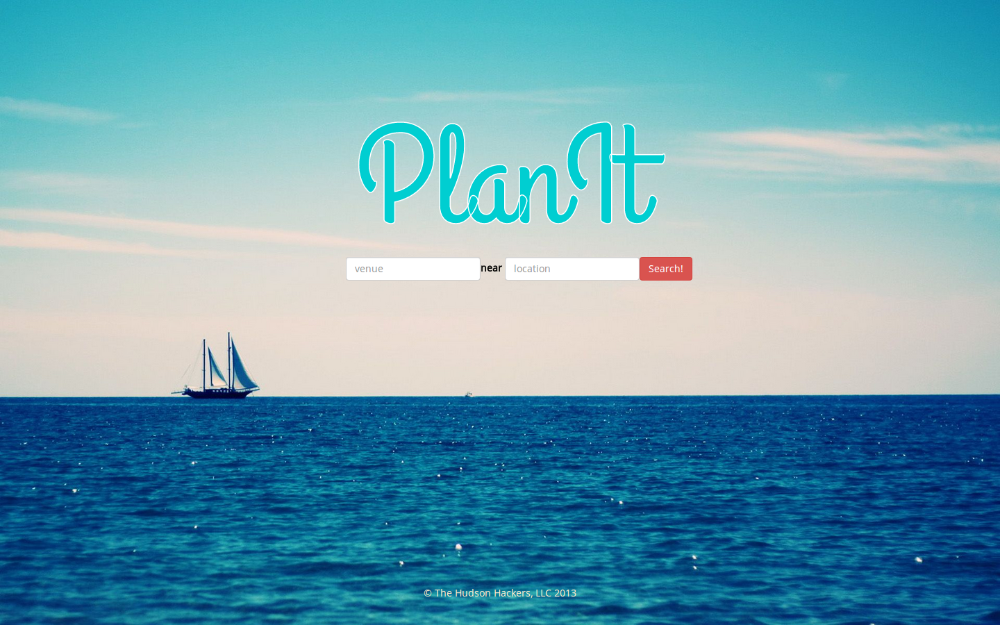
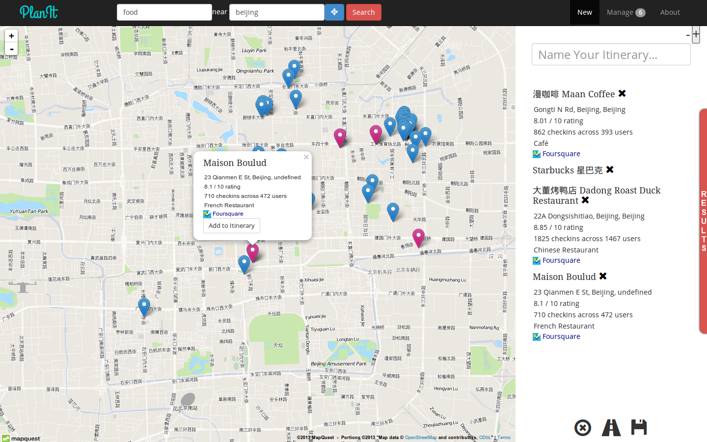

PlanIt
======

The Hudson Hackers
------------------

*    Will McAuliff
*    Emily Schultz
*    Sean Wong
*    Stephen Zhou

What is it?
-----------

Finding it difficult to plan an event? PlanIt allows you to easily plan a
spatial and interactive itinerary using popular and reviewed locations from the
Foursquare API.

Folder Hierarchy
----------------

    ├── css                     (Our css)
    ├── js                      (Our javascript)
    ├── lib                     (Third-party libraries)
    │   ├── bootstrap
    │   ├── foursquare
    │   ├── jquery
    │   └── leaflet
    ├── about.html              (About page)
    ├── favicon.png             (favicon)
    ├── index.html              (Splash page)
    ├── manage.html             (Manage itineraries page)
    ├── README.md               (This file)
    └── view.html               (Create itinerary page)

Screen Shots
------------

